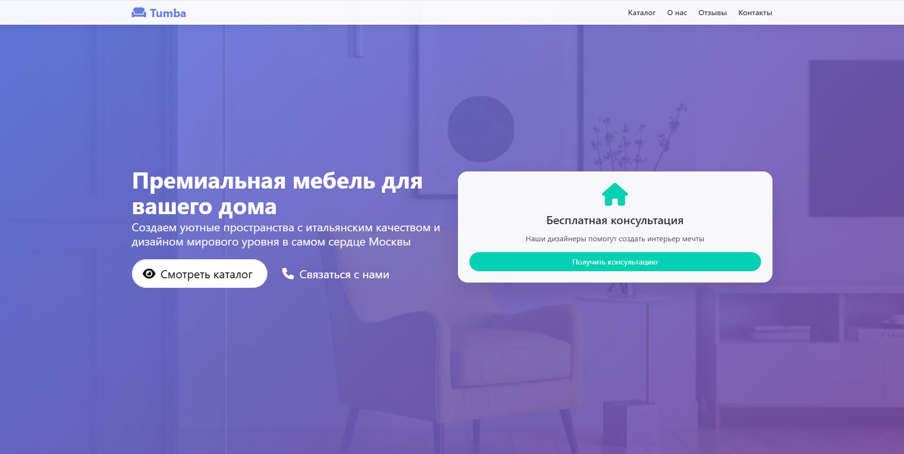
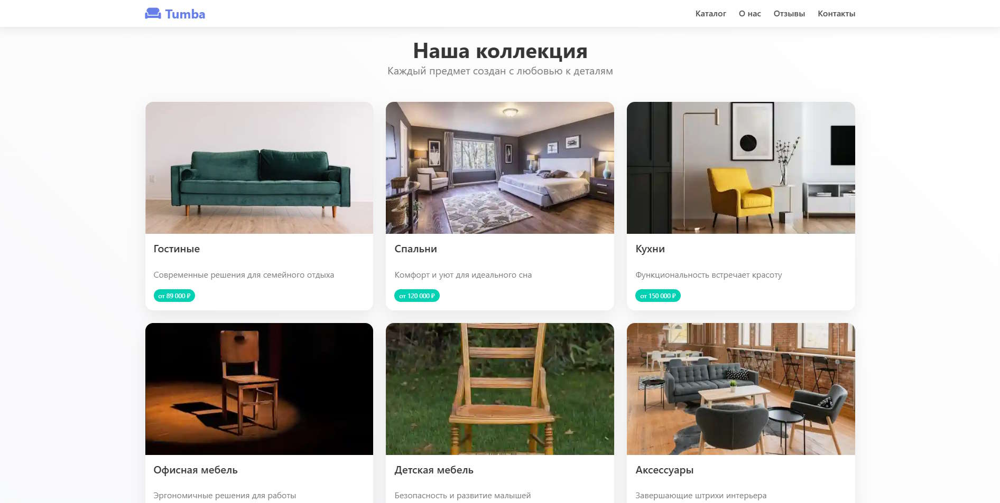
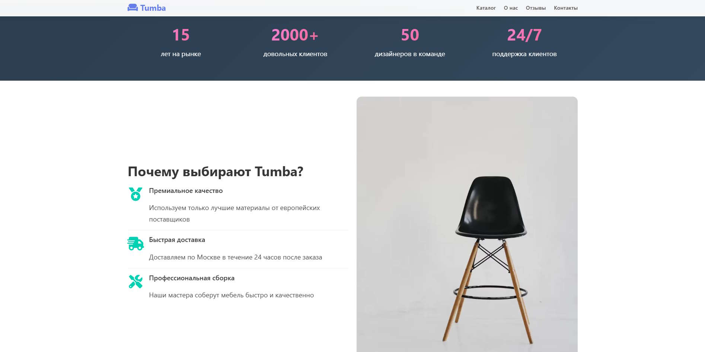
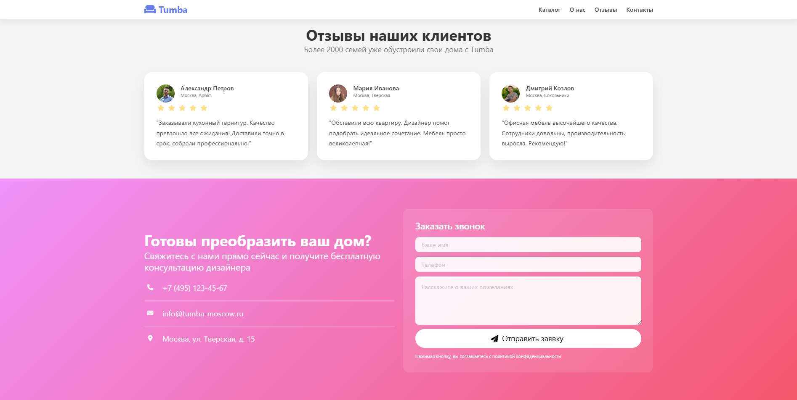

# 🪑 Tumba - Премиальная мебель в Москве

Современный лендинг-сайт для мебельной компании Tumba, специализирующейся на продаже качественной мебели в Москве. Сайт создан с использованием современных веб-технологий и следует принципам UX/UI дизайна.

## 🎯 Описание проекта

Tumba - это одностраничный сайт (лендинг) мебельной компании, который демонстрирует каталог продукции, преимущества компании, отзывы клиентов и предоставляет удобные способы связи. Сайт оптимизирован для конверсии и направлен на привлечение потенциальных клиентов.

## 🚀 Основные возможности

### 📱 Адаптивный дизайн
- Полная адаптация под все устройства (десктоп, планшет, мобильный)
- Оптимизированный интерфейс для touch-устройств
- Responsive изображения и контент

### 🎨 Современный UI/UX
- Градиентные фоны и современная цветовая палитра
- Glassmorphism эффекты для карточек
- Плавные анимации и hover-эффекты
- Микроанимации для улучшения пользовательского опыта

### 🔧 Интерактивные элементы
- Плавная прокрутка между секциями
- Анимированная форма обратной связи
- Адаптивное навигационное меню
- Автоматически скрывающийся navbar при скролле
- Анимации появления элементов при прокрутке

### 📊 Функциональные секции
- **Hero-секция** с призывом к действию
- **Каталог продукции** с категориями мебели
- **Статистика компании** с ключевыми показателями
- **Преимущества** с иконками и описаниями
- **Отзывы клиентов** с реальными фотографиями
- **Контактная форма** с валидацией
- **Подробный футер** с навигацией и контактами

## 🛠 Технологии и инструменты

### Frontend
- **HTML5** - семантическая разметка
- **CSS3** - стилизация и анимации
- **JavaScript (ES6+)** - интерактивность и динамика
- **Bulma CSS Framework** - основа для стилей и компонентов

### Внешние библиотеки и сервисы
- **Font Awesome 6.0.0** - иконки
- **Google Fonts** - типографика
- **Unsplash** - высококачественные изображения
- **CDNJS** - CDN для подключения библиотек

### Дизайн принципы
- **Mobile-first** подход
- **Progressive Enhancement**
- **Semantic HTML**
- **BEM methodology** (частично)
- **Modern CSS** (Flexbox, Grid, Custom Properties)

## 📁 Структура проекта

```
tumba-landing/
│
├── index.html              # Основной HTML файл
├── README.md              # Документация проекта
├── assets/                # Ресурсы (если есть локальные файлы)
│   ├── images/           # Изображения
│   ├── css/              # Дополнительные стили
│   └── js/               # Дополнительные скрипты
└── docs/                 # Дополнительная документация
```

## 🎨 Дизайн особенности

### Цветовая палитра
- **Основной градиент**: `linear-gradient(135deg, #667eea 0%, #764ba2 100%)`
- **Вторичный градиент**: `linear-gradient(135deg, #f093fb 0%, #f5576c 100%)`
- **Темный градиент**: `linear-gradient(135deg, #2c3e50 0%, #34495e 100%)`

### Типографика
- **Основной шрифт**: Segoe UI, Tahoma, Geneva, Verdana, sans-serif
- **Межстрочный интервал**: 1.7 для лучшей читаемости
- **Иерархия заголовков**: от h1 до h6 с соответствующими размерами

### Анимации
- **Hover эффекты** для карточек и кнопок
- **Появление элементов** при скролле (Intersection Observer API)
- **Плавная прокрутка** между секциями
- **Pulse анимация** для CTA кнопок

## 🔧 Установка и запуск

### Требования
- Современный веб-браузер (Chrome, Firefox, Safari, Edge)
- Веб-сервер (опционально, для разработки)

### Локальный запуск
1. Клонируйте репозиторий:
```bash
git clone https://github.com/your-username/tumba-landing.git
```

2. Откройте файл `index.html` в браузере или:
```bash
# Используя Python (если установлен)
python -m http.server 8000

# Используя Node.js (если установлен npx)
npx serve .

# Используя PHP (если установлен)
php -S localhost:8000
```

3. Откройте `http://localhost:8000` в браузере

## 📱 Совместимость браузеров

- ✅ Chrome 60+
- ✅ Firefox 55+
- ✅ Safari 12+
- ✅ Edge 79+
- ✅ iOS Safari 12+
- ✅ Chrome Mobile 60+

## 🔍 SEO оптимизация

- Семантическая HTML5 разметка
- Оптимизированные мета-теги
- Структурированные данные (Schema.org)
- Оптимизированные изображения
- Быстрая загрузка страницы
- Мобильная оптимизация

## 📈 Производительность

### Оптимизации
- Минимизированный CSS и JavaScript
- Оптимизированные изображения через Unsplash
- Ленивая загрузка изображений
- Кэширование статических ресурсов
- Использование CDN для библиотек

### Метрики
- **Время загрузки**: < 3 секунд
- **First Contentful Paint**: < 1.5 секунд
- **Largest Contentful Paint**: < 2.5 секунд
- **Cumulative Layout Shift**: < 0.1

## 🧪 Тестирование

### Тестирование адаптивности
- Проверка на различных разрешениях экрана
- Тестирование на реальных устройствах
- Проверка в DevTools браузера

### Кроссбраузерное тестирование
- Тестирование во всех основных браузерах
- Проверка fallback'ов для старых браузеров
- Валидация HTML и CSS

## 🔒 Безопасность

- Валидация форм на клиентской стороне
- Защита от XSS атак
- Content Security Policy (CSP)
- Безопасные внешние ссылки

## 🚀 Возможности для развития

### Планируемые улучшения
- [ ] Интеграция с CMS системой
- [ ] Добавление онлайн каталога с фильтрами
- [ ] Система онлайн заказов
- [ ] Интеграция с CRM системой
- [ ] Многоязычность
- [ ] PWA функциональность
- [ ] Интеграция с социальными сетями
- [ ] Система отзывов и рейтингов
- [ ] Калькулятор стоимости мебели
- [ ] 3D визуализация мебели

### Техническое развитие
- [ ] Переход на современный фреймворк (React/Vue)
- [ ] Добавление TypeScript
- [ ] Внедрение системы сборки (Webpack/Vite)
- [ ] Автоматизация деплоя (CI/CD)
- [ ] Мониторинг производительности
- [ ] A/B тестирование

## 📞 Контакты и поддержка

Если у вас есть вопросы по проекту или предложения по улучшению:

- 📧 **Email**: info@tumba-moscow.ru
- 📱 **Телефон**: +7 (495) 123-45-67
- 🏢 **Адрес**: Москва, ул. Тверская, д. 15

## 📄 Лицензия

Этот проект создан в демонстрационных целях. Все изображения взяты с Unsplash под соответствующими лицензиями.

## 🙏 Благодарности

- **Unsplash** - за качественные изображения
- **Bulma** - за отличный CSS фреймворк
- **Font Awesome** - за иконки
- **CDNJS** - за CDN сервис

---

*Сделано с ❤️ для создания современного и функционального веб-сайта мебельной компании*